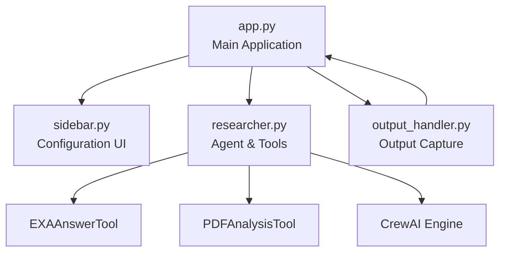
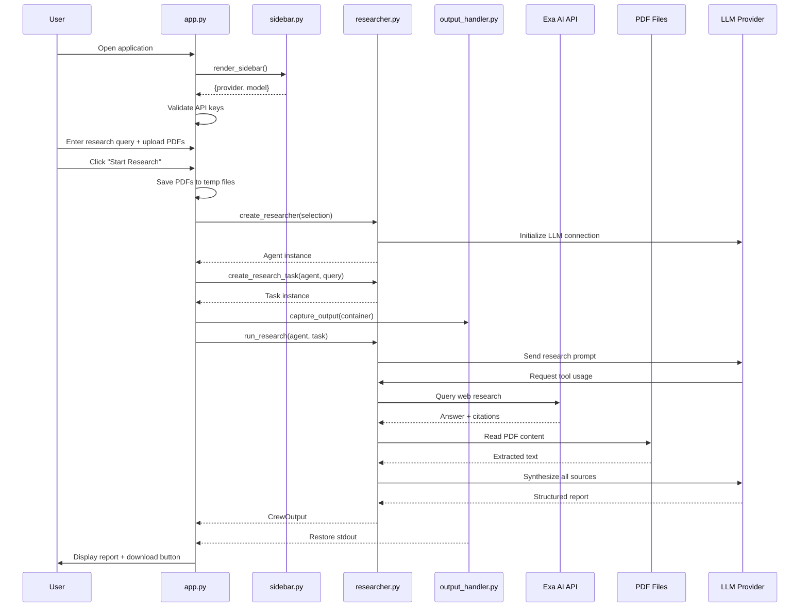
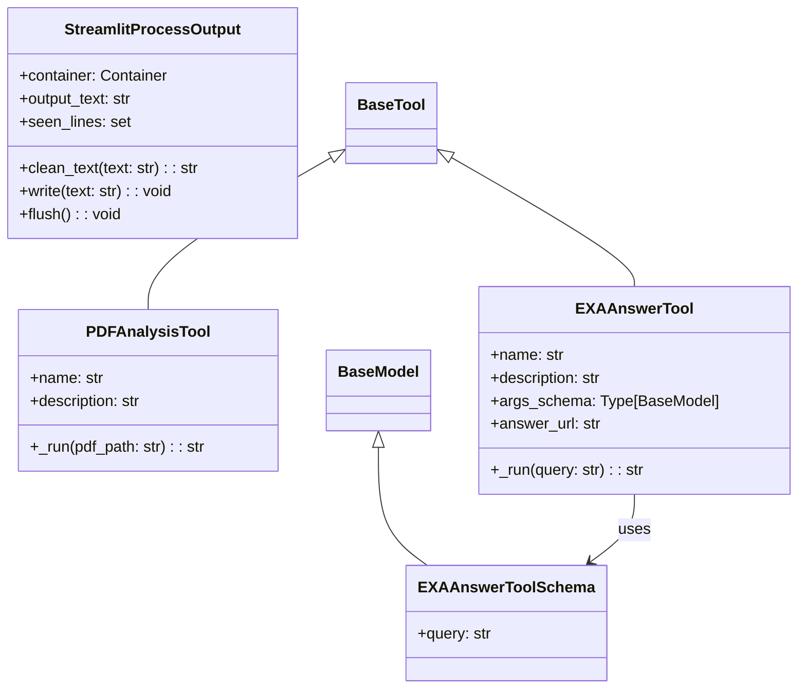

# Software Design Specification (SDS)
## InSight Forge — AI-Powered Academic Literature Review & Research Assistant

**Version:** 1.0  
**Date:** May 4, 2026  
**Project:** InSight Forge  

---

## Table of Contents

1. [Introduction](#1-introduction)
2. [System Architecture](#2-system-architecture)
3. [Component Design](#3-component-design)
4. [Data Flow](#4-data-flow)
5. [Class & Module Design](#5-class--module-design)
6. [Data Storage Design](#6-data-storage-design)
7. [Interface Design](#7-interface-design)
8. [Error Handling Strategy](#8-error-handling-strategy)
9. [Deployment Architecture](#9-deployment-architecture)

---

## 1. Introduction

### 1.1 Purpose

This Software Design Specification (SDS) describes the internal architecture, component design, data flow, and implementation details of InSight Forge. It translates the requirements defined in the [SRS](file:///home/raizel/.gemini/antigravity/brain/1c7a5f5e-e425-4f36-ab0b-36a8a02f41aa/SRS.md) into a concrete technical design.

### 1.2 Scope

This document covers the design of all modules, classes, functions, data flows, and interfaces within InSight Forge. It is intended for developers implementing, maintaining, or extending the system.

### 1.3 Design Goals

- **Modularity:** Separate concerns into distinct, reusable modules
- **Extensibility:** Support new LLM providers and tools with minimal code changes
- **Simplicity:** Keep the architecture lean — single-agent, sequential execution
- **Real-time Feedback:** Provide live progress updates during long-running research tasks

---

## 2. System Architecture

### 2.1 High-Level Architecture

```
┌─────────────────────────────────────────────────────────┐
│                  PRESENTATION LAYER                      │
│              Streamlit Web Application                    │
│  ┌──────────┐  ┌────────────────┐  ┌─────────────────┐  │
│  │ Sidebar  │  │  Research Input │  │ Results Display │  │
│  │ (Config) │  │  + PDF Upload   │  │ + Download      │  │
│  └──────────┘  └────────────────┘  └─────────────────┘  │
└────────────────────────┬────────────────────────────────┘
                         │
                         ▼
┌─────────────────────────────────────────────────────────┐
│                   BUSINESS LOGIC LAYER                    │
│                    CrewAI Engine                          │
│  ┌──────────────────────────────────────────────────┐   │
│  │  Senior Academic Research Analyst (Agent)         │   │
│  │  ┌──────────────┐  ┌───────────────────────────┐ │   │
│  │  │ EXA Answer   │  │ PDF Analysis Tool         │ │   │
│  │  │ Tool (Web)   │  │ (pypdf)                   │ │   │
│  │  └──────┬───────┘  └──────────┬────────────────┘ │   │
│  └─────────┼─────────────────────┼──────────────────┘   │
│            │                     │                       │
│  ┌─────────┴─────────────────────┴──────────────────┐   │
│  │           Output Handler (stdout capture)         │   │
│  └───────────────────────────────────────────────────┘   │
└────────────┬─────────────────────┬──────────────────────┘
             │                     │
             ▼                     ▼
┌─────────────────────┐   ┌──────────────────┐
│   EXTERNAL SERVICES │   │  LOCAL RESOURCES  │
│  ┌───────────────┐  │   │  ┌────────────┐  │
│  │  Exa AI API   │  │   │  │ PDF Files  │  │
│  ├───────────────┤  │   │  ├────────────┤  │
│  │  OpenAI API   │  │   │  │ Ollama     │  │
│  ├───────────────┤  │   │  ├────────────┤  │
│  │  GROQ API     │  │   │  │ File System│  │
│  └───────────────┘  │   │  └────────────┘  │
└─────────────────────┘   └──────────────────┘
```

### 2.2 Architectural Pattern

The system follows a **three-layer architecture**:

| Layer | Responsibility | Components |
|-------|---------------|------------|
| **Presentation** | User interaction, configuration, display | `app.py`, `sidebar.py` |
| **Business Logic** | AI agent orchestration, research execution | `researcher.py`, `output_handler.py` |
| **External Services** | Data retrieval, LLM inference | Exa API, OpenAI/GROQ/Ollama APIs |

### 2.3 Technology Mapping

| Component | Technology |
|-----------|-----------|
| Web Framework | Streamlit |
| Agent Framework | CrewAI (Agent, Task, Crew, Process) |
| LLM Abstraction | CrewAI `LLM` class |
| Web Search | Exa AI REST API via `requests` |
| PDF Extraction | `pypdf.PdfReader` |
| Data Validation | Pydantic `BaseModel` |
| Output Capture | Custom `sys.stdout` replacement |

---

## 3. Component Design

### 3.1 Component Overview



### 3.2 Component Responsibilities

#### 3.2.1 `app.py` — Application Controller

**Purpose:** Entry point and orchestrator for the Streamlit application.

| Responsibility | Details |
|---------------|---------|
| Page configuration | Sets title, icon, layout, sidebar state |
| Sidebar integration | Calls `render_sidebar()` to get provider/model config |
| Input handling | Research query text area + PDF file uploader |
| Validation | Checks required API keys before allowing research |
| Execution coordination | Creates agent → creates task → runs crew |
| PDF management | Saves uploaded PDFs to temp files, appends paths to task |
| Result display | Renders Markdown report + download button |
| SQLite patching | Patches `sqlite3` module with `pysqlite3` for ChromaDB |

**Design Decisions:**
- SQLite patching is done at module load time (before any imports that might trigger ChromaDB)
- PDF temp files use `delete=False` to persist across the Streamlit execution context
- The `capture_output` context manager wraps the entire research execution block

#### 3.2.2 `sidebar.py` — Configuration Module

**Purpose:** Renders sidebar UI and manages user configuration state.

**Functions:**

| Function | Signature | Returns |
|----------|-----------|---------|
| `get_ollama_models()` | `() → list[str]` | List of available Ollama model names |
| `render_sidebar()` | `() → dict` | `{"provider": str, "model": str}` |

**Design Decisions:**
- API keys are set directly as environment variables (`os.environ`) for simplicity — CrewAI's LLM class reads them from there
- Ollama model discovery fails silently (returns empty list) to avoid breaking the UI
- The "Custom" model option triggers a conditional text input field

#### 3.2.3 `researcher.py` — Agent & Tools Module

**Purpose:** Defines the AI research agent, its tools, and the task/crew execution logic.

**Classes:**

| Class | Base Class | Purpose |
|-------|-----------|---------|
| `PDFAnalysisTool` | `crewai.tools.BaseTool` | Extracts text from uploaded PDF files |
| `EXAAnswerToolSchema` | `pydantic.BaseModel` | Input validation schema for Exa tool |
| `EXAAnswerTool` | `crewai.tools.BaseTool` | Queries Exa AI for web research with citations |

**Functions:**

| Function | Input | Output | Purpose |
|----------|-------|--------|---------|
| `create_researcher(selection)` | `dict` with provider/model | `crewai.Agent` | Creates configured research agent |
| `create_research_task(researcher, task_description)` | Agent + query string | `crewai.Task` | Creates task with output template |
| `run_research(researcher, task)` | Agent + Task | `CrewOutput` | Assembles and executes the Crew |

**Design Decisions:**
- Single-agent architecture (no delegation) for simplicity and predictability
- Tool instances are created fresh per agent instantiation
- PDF content is truncated to 12,000 chars to prevent LLM context overflow
- The expected output template is hardcoded to enforce report structure consistency

#### 3.2.4 `output_handler.py` — Output Capture Module

**Purpose:** Captures and cleans the CrewAI agent's verbose stdout output for real-time display.

**Class: `StreamlitProcessOutput`**

| Attribute | Type | Purpose |
|-----------|------|---------|
| `container` | Streamlit container | Target UI element for display |
| `output_text` | `str` | Accumulated cleaned output |
| `seen_lines` | `set` | Tracks displayed lines for deduplication |

| Method | Purpose |
|--------|---------|
| `clean_text(text)` | Removes ANSI codes, LiteLLM noise, formatting tokens |
| `write(text)` | Processes, deduplicates, and displays new output |
| `flush()` | No-op (stdout compatibility) |

**Context Manager: `capture_output(container)`**
- Replaces `sys.stdout` with `StreamlitProcessOutput`
- Uses `try/finally` to guarantee stdout restoration

---

## 4. Data Flow

### 4.1 Main Research Flow



### 4.2 Data Transformation Pipeline

```
User Query (string)
    │
    ├─→ + PDF paths appended → Full Task Description
    │
    ▼
CrewAI Task
    │
    ├─→ EXA Tool → Web Answer + Citations (string)
    ├─→ PDF Tool → Extracted Text (string, ≤12,000 chars)
    │
    ▼
LLM Synthesis
    │
    ▼
Structured Markdown Report
    │
    ├─→ output/research_report.md (file)
    ├─→ Streamlit UI (rendered Markdown)
    └─→ Download button (browser download)
```

---

## 5. Class & Module Design

### 5.1 Class Diagram



### 5.2 Function Specifications

#### `create_researcher(selection: dict) → Agent`

```
Input:  {"provider": "OpenAI"|"GROQ"|"Ollama", "model": "<model_name>"}
Output: crewai.Agent configured with selected LLM and tools

Logic:
  1. Extract provider and model from selection
  2. Switch on provider:
     - GROQ  → LLM(api_key=GROQ_API_KEY, model="groq/{model}")
     - Ollama → LLM(base_url="localhost:11434", model="ollama/{model}")
     - OpenAI → LLM(api_key=OPENAI_API_KEY, model="openai/{model}")
       + Normalize legacy model names (GPT-3.5 → gpt-3.5-turbo)
  3. Create Agent with role, goal, backstory, tools, LLM
  4. Return Agent
```

#### `create_research_task(researcher: Agent, task_description: str) → Task`

```
Input:  Agent instance + research query string
Output: crewai.Task with structured expected output template

Logic:
  1. Create Task with:
     - description = task_description
     - expected_output = hardcoded Markdown template (7 sections)
     - agent = researcher
     - output_file = "output/research_report.md"
  2. Return Task
```

#### `run_research(researcher: Agent, task: Task) → CrewOutput`

```
Input:  Agent + Task instances
Output: CrewOutput with the generated research report

Logic:
  1. Create Crew with [researcher], [task], sequential process, verbose=True
  2. Call crew.kickoff()
  3. Return result
```

---

## 6. Data Storage Design

### 6.1 Storage Overview

InSight Forge has **no database**. All data is transient or file-based.

| Data | Storage Type | Location | Lifecycle |
|------|-------------|----------|-----------|
| API Keys | Environment variables (in-memory) | `os.environ` | Session-scoped; cleared on browser close |
| Uploaded PDFs | Temporary files | OS temp directory | Created per research run; not explicitly cleaned |
| Research Report | File | `output/research_report.md` | Overwritten each run |
| Agent Output | In-memory string | `StreamlitProcessOutput.output_text` | Session-scoped |
| Streamlit Session State | In-memory | Streamlit session | Session-scoped |

### 6.2 File I/O Operations

| Operation | Module | Path | Mode |
|-----------|--------|------|------|
| Write temp PDF | `app.py` | `tempfile.NamedTemporaryFile` | Write binary |
| Read PDF | `researcher.py` | User-specified path | Read binary |
| Write report | CrewAI (via `output_file`) | `output/research_report.md` | Write text |

---

## 7. Interface Design

### 7.1 UI Layout Design

```
┌────────────────────────────────────────────────────────────────┐
│  SIDEBAR (Collapsible)           │  MAIN CONTENT AREA          │
│  ┌────────────────────────────┐  │                              │
│  │ ⚙️ Configuration           │  │  ┌─[col1]─┬─[col2]─┬─[col3]┐│
│  │ ┌────────────────────────┐ │  │  │        │InSight │       ││
│  │ │ 🤖 Model Selection     │ │  │  │        │ Forge  │       ││
│  │ │  ○ OpenAI ○ GROQ       │ │  │  └────────┴────────┴───────┘│
│  │ │  ○ Ollama              │ │  │                              │
│  │ │  [Model Dropdown ▼]    │ │  │  ┌──────────────────────────┐│
│  │ └────────────────────────┘ │  │  │ What would you like to   ││
│  │ ┌────────────────────────┐ │  │  │ research?                ││
│  │ │ 🔑 API Keys            │ │  │  │ [Text Area.............. ││
│  │ │  Provider Key: [****]  │ │  │  │ ........................]││
│  │ │  EXA Key:      [****]  │ │  │  │                          ││
│  │ └────────────────────────┘ │  │  │ Upload PDFs (Optional)   ││
│  │ ┌────────────────────────┐ │  │  │ [Browse files...]        ││
│  │ │ ℹ️ About               │ │  │  └──────────────────────────┘│
│  │ └────────────────────────┘ │  │                              │
│  └────────────────────────────┘  │     [Start Research]         │
│                                  │                              │
│                                  │  ┌──────────────────────────┐│
│                                  │  │ ▶ Researching...         ││
│                                  │  │ ┌────────────────────┐   ││
│                                  │  │ │ Agent output...    │   ││
│                                  │  │ │ (scrollable 300px) │   ││
│                                  │  │ └────────────────────┘   ││
│                                  │  └──────────────────────────┘│
│                                  │                              │
│                                  │  [Rendered Markdown Report]  │
│                                  │  ──────────────────────────  │
│                                  │  [Download Report]           │
│                                  │  ──────────────────────────  │
│                                  │  Made with ❤️ using CrewAI   │
└──────────────────────────────────┴──────────────────────────────┘
```

### 7.2 API Interface Design

#### Exa AI Answer API

```
POST https://api.exa.ai/answer
Headers:
  accept: application/json
  content-type: application/json
  x-api-key: <EXA_API_KEY>
Body:
  { "query": "<search_query>", "text": true }
Response:
  {
    "answer": "<answer_text>",
    "citations": [
      { "title": "<title>", "url": "<url>" }
    ]
  }
```

#### Ollama Model Discovery API

```
GET http://localhost:11434/api/tags
Response:
  {
    "models": [
      { "name": "<model_name>", ... }
    ]
  }
```

---

## 8. Error Handling Strategy

### 8.1 Error Handling Matrix

| Component | Error Scenario | Handling Strategy |
|-----------|---------------|-------------------|
| `app.py` | `pysqlite3` not installed | Silent fallback (`try/except ImportError`) |
| `app.py` | Missing API keys | Display `st.warning()`, call `st.stop()` |
| `app.py` | Research execution failure | Display `st.error()` with exception details, update status to "Error" |
| `sidebar.py` | Ollama unreachable | Return empty model list, display warning |
| `researcher.py` | PDF read failure | Return error string (no exception propagation) |
| `researcher.py` | Exa API error | Raise exception (caught by `app.py`) |
| `output_handler.py` | stdout capture failure | `try/finally` guarantees stdout restoration |

### 8.2 Exception Flow

```
app.py try/except block
  │
  ├─ Success → status="complete", display report
  │
  └─ Exception → status="error", st.error(message), st.stop()
```

---

## 9. Deployment Architecture

### 9.1 Local Development

```
User's Machine
├── Python 3.10+ (venv)
│   ├── streamlit (web server on :8501)
│   ├── crewai + crewai-tools
│   ├── pypdf, PyMuPDF, requests, pydantic
│   └── pysqlite3-binary
├── Ollama (optional, on :11434)
└── Browser → http://localhost:8501
```

### 9.2 Startup Sequence

```
1. python -m venv .venv && source .venv/bin/activate
2. pip install -r requirements.txt
3. streamlit run app.py
4. Browser opens → http://localhost:8501
5. Streamlit executes app.py (full script re-run on each interaction)
```

### 9.3 Configuration Files

| File | Purpose |
|------|---------|
| `requirements.txt` | Python package dependencies |
| `.streamlit/` | Streamlit configuration directory (theme, server settings) |
